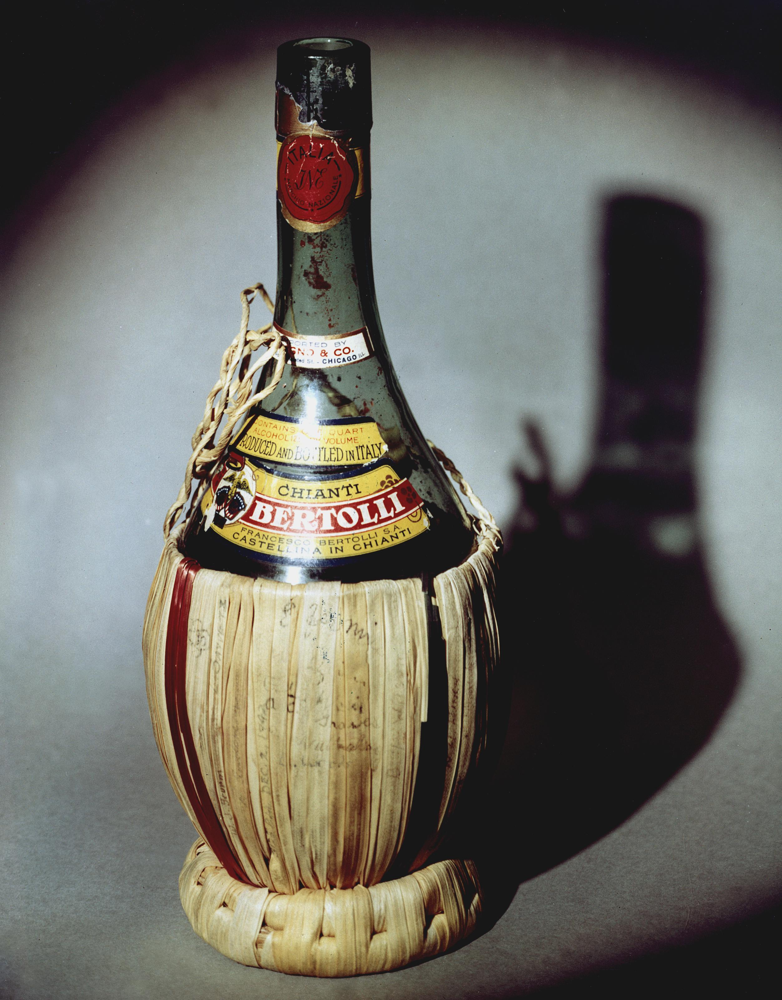

fiasco Documentation
=====================

.. warning:: fiasco is still in the early stages of development and as such frequent changes will be
             made to the API. Use at your own risk.

.. warning:: fiasco currently only supports the most recent version (v8) of the CHIANTI database. In
             the future, older versions of the database will be supported.

   A *fiasco*, or flask, is the typical style of bottle used to serve the Chianti Classico wine. In the same way, the fiasco package serves up the CHIANTI atomic database. Image credit: `Wikipedia`_

Welcome to the documentation for fiasco. fiasco provides a Python interface to the `CHIANTI atomic database`_. In addition to several high-level abstractions of the atomic data, fiasco also provides many common atomic physics calculations.

.. toctree::
  :maxdepth: 2

  getting_started
  tutorial
  code_ref/index
  dev_guide
  resources

.. _CHIANTI atomic database: http://www.chiantidatabase.org/
.. _Wikipedia: https://commons.wikimedia.org/wiki/File:HD.5A.036_(10555475386).jpg
